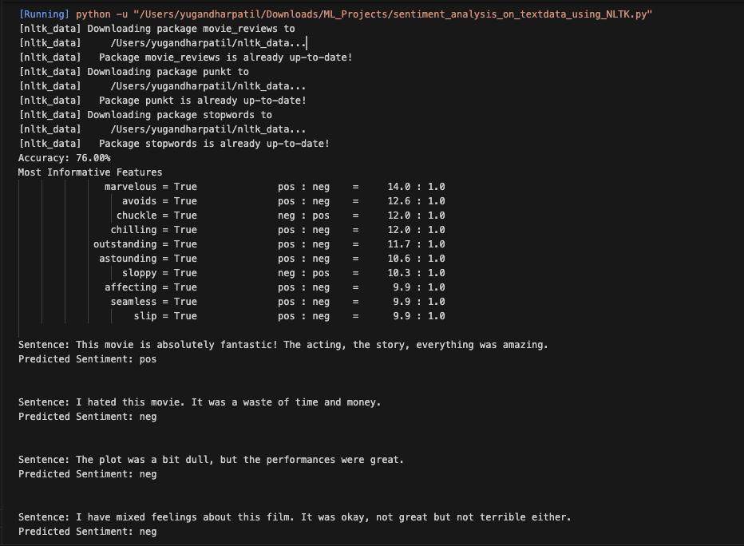

# Sentiment Analysis on Text Data using NLTK 🎭

This project demonstrates a basic **Sentiment Analysis classifier** using the **NLTK (Natural Language Toolkit)** and a **Naive Bayes algorithm**. It trains on the `movie_reviews` dataset and predicts whether a given sentence expresses a positive or negative sentiment.

---

## 📌 Features

- Uses NLTK’s `movie_reviews` dataset
- Cleans and tokenizes text input
- Removes stopwords
- Trains a Naive Bayes Classifier
- Evaluates model accuracy
- Predicts sentiment of new text inputs

---

## 🔧 Installation

1. Clone this repository:
   ```bash
   git clone https://github.com/yugpatill/sentiment_analysis_on_textdata_using_NLTK
   ```


